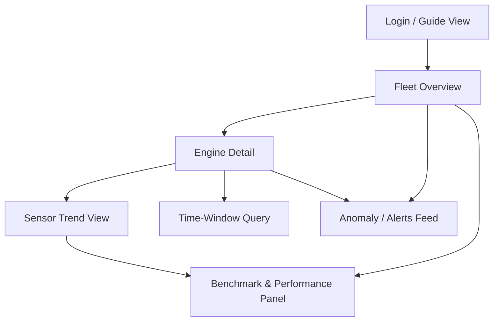
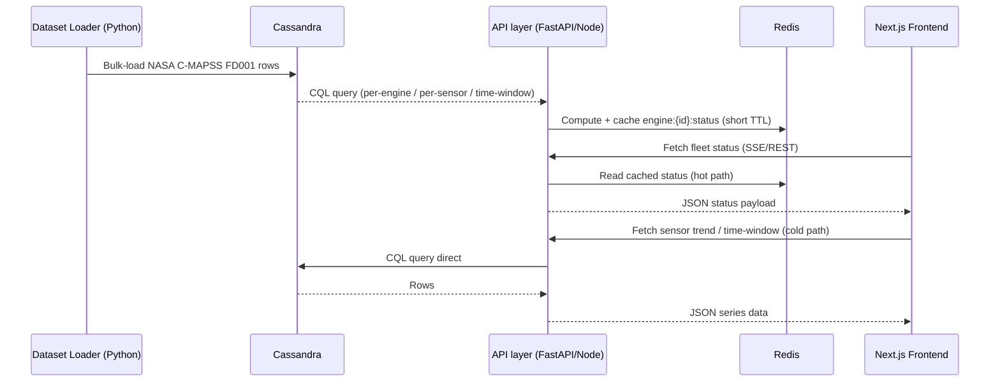

# Aircraft Engine Health Monitoring System — Frontend Prototype Spec

**Course:** E1CSA 363 — NoSQL Databases · Microproject 9
**Scope of this document:** UI/UX direction, design system (color/type/icons), asset sourcing, production-grade tech stack, and a detailed frontend workflow spec — written so a prototype can be built directly on top of it. This is a planning document, not code.

---

## 1. How the style was chosen

Three 2026 UI/UX research threads were cross-checked before landing on a direction:

- **General 2026 UI/UX trend research** — the dominant enterprise-tool trend is a pullback from decorative SaaS gradients toward *structural, grid-forward interfaces*. Designers are treating grids as a visible foreground element rather than a hidden guide, bringing "blueprint" and wireframe logic into final UI, and pairing it with monospaced or mono-inspired type to align visual rhythm with data logic. Separately, 2026 dashboard-specific research confirms **neo-brutalism** (bold type, asymmetry, geometric blocks) as one of two style movements currently dominating dashboard design, alongside a more restrained, glass/dark-mode analytics look.
- **Dark-mode operational-dashboard research** — for monitoring/NOC-style tools specifically (the closest analogue to an engine-health dashboard), the winning pattern in 2026 examples is a near-black (not pure black) base, restrained accent colors tied to operational status, and monospaced type for metrics — exemplified by dashboards like "Signal," a DevOps monitoring UI built with a terminal aesthetic (JetBrains Mono typography, near-black palette, neon-green "healthy" semantics) designed to be glanced at in low-light NOCs, with colors that map directly to operational status. General dark-UI guidance backs this up: a dark gray or navy background around `#0f172a` is easier on the eyes than pure black and lets you layer cards with subtle surface steps.
- **Aviation-specific reference** — an existing open-source UAV telemetry dashboard (React/Vite) validates that a "dark avionic" aesthetic — aviation-style instrument gauges, an artificial-horizon widget, and instrument-panel framing around live maps and historical charts — is a proven, buildable pattern, not just a mood-board idea (see §3).

**Chosen direction: "Instrument-Panel Minimalism"** — a hybrid of (a) Swiss/structural minimalism for layout discipline, (b) a restrained neo-brutalist edge (visible hairline grids, blocky status modules, no soft gradients/glassmorphism) for the "engineering instrument" feel, and (c) real aviation color conventions instead of generic SaaS accent colors. This is deliberately **not** glassmorphism or full neo-brutalism — those read as either too soft (fails the "engineering telemetry" brief) or too loud/playful (wrong tone for a safety-monitoring tool). It sits closer to the "Signal" terminal-aesthetic dashboard than to a consumer analytics product.

The same structural layout and type system run in **two themes, not one**: a dark "Glass Cockpit" mode modeled on real Multi-Function Display (MFD) conventions for the professional/engineering read, and a light "Skyline Day" mode modeled on clear-sky/airline-brand colors for a brighter, more memorable first impression — both detailed in §2.1. Both are real, switchable options; dark is simply the default.

---

## 2. Design System

### 2.1 Color palettes — dark for professionalism, light for "wow"

Both modes are first-class (see §4.1 — `next-themes` ships a toggle, dark is just the default). They're deliberately **not** a simple invert-the-hex-values pair — each is built for a different job, the way real airline brands run a "technical" dark ops-console look alongside a bright, optimistic customer-facing look, while keeping status colors legible in both.

#### 2.1a Dark mode — "Glass Cockpit Dark" *(default, professional/engineering mode)*

Modeled on real aircraft glass-cockpit MFD conventions (amber caution / red warning / green nominal / cyan informational against a near-black panel), not a generic dashboard template palette.

| Token | Hex | Use |
|---|---|---|
| `--bg-canvas` | `#0B0F14` | App background (near-black navy, not pure `#000`) |
| `--bg-surface` | `#121821` | Card / panel background |
| `--bg-surface-raised` | `#1A222D` | Elevated cards, modals, hover state |
| `--border-hairline` | `#26313D` | 1px structural grid lines (kept *visible*, not hidden — core to the blueprint look) |
| `--text-primary` | `#E7EDF3` | Headings, primary readouts |
| `--text-secondary` | `#93A2B0` | Labels, captions |
| `--text-muted` | `#5B6B79` | Disabled / tertiary text |
| `--accent-primary` | `#22D3EE` (cyan) | Primary brand/data accent — "informational" telemetry blue |
| `--accent-secondary` | `#F5A623` (amber) | Secondary accent, doubles as warning state (matches real cockpit caution-amber) |
| `--status-nominal` | `#34D399` | Engine healthy / normal reading |
| `--status-warning` | `#F5A623` | Sensor drifting out of range |
| `--status-critical` | `#F5455C` | Threshold breach / anomaly flagged |
| `--chart-series-1..4` | `#22D3EE`, `#F5A623`, `#A78BFA`, `#34D399` | Multi-sensor overlay chart lines |

#### 2.1b Light mode — "Skyline Day" *(the "wow" mode — clear-sky/airline-brand vibe)*

Built on the real sky-blue hex family most airline and travel brands actually use (`#87CEEB`-`#1E9CD4` range is the most-referenced clear-sky blue), paired with cloud-white surfaces, a deep-navy anchor for text (echoes cockpit/fuselage navy trim), and a warm sunrise-orange accent for pop — the same "one signature blue + one neutral + one warm accent" formula real sky/airline brand palettes use so the light theme doesn't just read as an inverted dark theme.

| Token | Hex | Use |
|---|---|---|
| `--bg-canvas` | `#F3F9FD` | App background — pale clear-sky tint, not flat white |
| `--bg-surface` | `#FFFFFF` | Card / panel background |
| `--bg-surface-raised` | `#EAF4FC` | Elevated cards, hover state — a touch more "sky" |
| `--border-hairline` | `#D6E6F2` | 1px structural grid lines — same visible-grid principle as dark mode |
| `--text-primary` | `#0B1F33` | Headings, primary readouts — deep navy, not pure black |
| `--text-secondary` | `#4C6478` | Labels, captions |
| `--text-muted` | `#8AA0B2` | Disabled / tertiary text |
| `--accent-primary` | `#1E9CD4` | Primary brand/data accent — the signature "clear sky" blue |
| `--accent-secondary` | `#FF7A45` | Sunrise-orange — hero moments, CTAs, active-tab underline (the "wow" pop color) |
| `--status-nominal` | `#16A34A` | Engine healthy / normal reading |
| `--status-warning` | `#D97706` | Sensor drifting out of range |
| `--status-critical` | `#DC2626` | Threshold breach / anomaly flagged |
| `--chart-series-1..4` | `#1E9CD4`, `#FF7A45`, `#7C6FE0`, `#16A34A` | Multi-sensor overlay chart lines |

Notes:
- **Status colors stay in the same hue family across both modes** (green = nominal, amber/orange = warning, red = critical in both) — only lightness/saturation shifts for contrast. A color should never mean something different depending on which theme is active.
- Use OKLCh color tokens (not flat hex) at implementation time — current shadcn/ui + Tailwind v4 dashboard builds bake both themes directly into Tailwind v4's OKLCh tokens so they propagate through every component automatically, and the tables above translate cleanly into that token structure.
- Where to use light mode's "wow" factor deliberately: the landing/guide screen, the Fleet Overview hero header, and empty/onboarding states — places a viewer/grader sees first. Keep the *data-dense* screens (Sensor Trend, Benchmark) visually calmer in either mode so the charts stay the focal point, not the background.

### 2.2 Typography

| Role | Font | Why |
|---|---|---|
| UI text (headings, nav, body) | **Geist Sans** (variable) | Clean, slightly mechanical letterforms tuned for density, which makes it a natural fit for dashboards, developer tools, and data-heavy UI. Free, OFL, self-hostable. |
| Data / metrics / sensor IDs / CQL & timestamps | **JetBrains Mono** or **Geist Mono** (variable) | Monospace signals "this is measured data" — the same logic used in the Signal dashboard reference above. JetBrains Mono is the safe default, covering the broadest set of practical use cases of any free monospaced font, with five weights, true italic, comprehensive ligature support, and clearly distinct character forms. Geist Mono is the alternative if pairing with Geist Sans for a single unified type family. |

Sources: Google Fonts (`fonts.google.com` — JetBrains Mono, Inter as a fallback UI font) and Vercel's own type site / GitHub for Geist + Geist Mono. Self-host the woff2 files rather than linking a third-party CDN, per current best practice.

### 2.3 Iconography

Style: **outline/lineal, 1.5–2px stroke, no fill** — matches the hairline-grid, instrument-panel language above (avoid glyph-style filled icons; they read as "consumer app," not "instrument panel").

Sources for aircraft/engine-specific icons (verify each icon's individual license before shipping — Noun Project and Flaticon require attribution or a paid plan for royalty-free use):

- Noun Project — aircraft-engine, jet-engine, turbofan, aviation icon sets: `thenounproject.com/browse/icons/term/aircraft-engine`, `thenounproject.com/browse/icons/term/jet-engine`, `thenounproject.com/browse/icons/term/turbofan`
- Flaticon — larger free aviation icon packs (lineal style, SVG/PNG/EPS): `flaticon.com/free-icons/aircraft-engine`, `flaticon.com/packs/aviation`
- **Lucide** (`lucide.dev`) — for generic UI icons (alerts, gauges, chevrons, status dots). MIT-licensed, already the default icon set for shadcn/ui, so no attribution overhead. Use Lucide for all *non-aviation-specific* icons and reserve Noun Project/Flaticon icons only for aircraft/engine imagery Lucide doesn't cover.
- For a hero illustration or engine cross-section diagram: consider a custom SVG (cheap to commission or trace) rather than a stock aviation photo — photos clash with the flat instrument-panel aesthetic.

### 2.4 Layout & motion principles

- **Grid stays visible.** 1px hairline borders between panels, not soft shadows — this is the "blueprint" cue from the trend research above.
- **Density over whitespace**, but with a strict 8px spacing scale so density doesn't become clutter.
- **Motion is functional only** — value transitions, live-tile pulse on data refresh, chart draw-in. No decorative animation, in line with the 2026 shift toward quieter, intent-driven motion, where users expect motion to explain rather than entertain, since unnecessary animation adds load time and mental effort without adding clarity.

---

## 3. Reference repositories (GitHub)

Use these as architecture/UI references, not for direct copy — none match the exact Cassandra + Redis stack from the problem statement, but each de-risks one part of the build:

| Repo | Why it's relevant |
|---|---|
| [`halilxibrahim/uav-telemetry-dashboard`](https://github.com/halilxibrahim/uav-telemetry-dashboard) | Closest visual reference: a dark avionic-themed interface with aviation-style instrument gauges, an artificial horizon, and Recharts-based telemetry charts, built in React + TypeScript + Vite. Good source for gauge/instrument component patterns. |
| [`Kiranism/next-shadcn-dashboard-starter`](https://github.com/Kiranism/next-shadcn-dashboard-starter) | Current (2026) reference implementation of the exact tech stack recommended in §4 — built on Next.js 16 App Router, React 19, and Tailwind CSS v4, with shadcn/ui on Base UI primitives, using TanStack Table plus React Query for data tables and nuqs for URL state. Best starting scaffold. |
| shadcn/ui official blocks (`ui.shadcn.com/blocks`) | dashboard-01 ships a collapsible sidebar, interactive Recharts charts, and a TanStack-powered data table — reference for the sidebar + charts + table shell described in §5. |
| [`Data-94/From-API-to-Dashboard-Real-Time-Analytics-with-Kafka-Dataproc-Spark-Cassandra`](https://github.com/Data-94) *(see Medium writeup)* | Reference architecture for streaming sensor data → Spark → Cassandra → dashboard: Spark processes and filters data, Cassandra stores historical logs, and Grafana displays trends and thresholds for predictive maintenance. Useful even though it targets Grafana, not a custom frontend — the ingestion→store→cache→visualize pipeline shape is identical to this project's. |
| `github.com/topics/cassandra-database` (topic search) | Multiple repos tagged for real-time aircraft telemetry monitoring that stream, analyze, and store in-flight sensor data for instant alerts and operational metrics, demonstrating flight safety, efficiency, and predictive maintenance through live telemetry — browse this topic for more aviation+Cassandra prior art. |
| [`hawkular/hawkular-metrics`](https://github.com/hawkular/hawkular-metrics) | Reference for how a real production system structures a Cassandra-backed time-series metrics engine with a REST layer on top — useful for the API-layer design in §4, independent of UI. |

---

## 4. Production-grade tech stack (2026)

This is the stack to actually build on, matching current (2026) production convention rather than what's typical in classroom NoSQL projects (Streamlit/Flask). It keeps Cassandra + Redis from the problem statement but puts a real frontend in front of them.

### 4.1 Frontend
| Layer | Choice | Notes |
|---|---|---|
| Framework | **Next.js 16** (App Router), **React 19**, **TypeScript** | Current default: React 19.2 handles components, hooks, and rendering; React Compiler reached 1.0 in October 2025, auto-memoizing components and removing most manual useMemo/useCallback. |
| Styling | **Tailwind CSS v4** | RSC-compatible, OKLCh tokens: runtime CSS-in-JS conflicts with React Server Components; Tailwind CSS v4 or CSS Modules are the compatible styling defaults. |
| Components | **shadcn/ui** (on Radix or Base UI primitives) | You own the generated component code directly rather than depending on a versioned package, and shadcn/ui added Base UI as an official alternative to Radix in early 2026. |
| Server-state / data fetching | **TanStack Query v5** | Cache + refetch layer for API/Cassandra reads and Redis-cached "current status" reads. |
| Table | **TanStack Table v8** | For engine lists, sensor-reading tables, benchmark result tables. |
| Client state | **Zustand** | Selected engine, active sensor, time-window filter, live/paused toggle. |
| Charts | **Recharts 3** (via shadcn's `chart` component) | Time-series sensor plots, degradation curves, latency-benchmark bars — pre-styled to theme tokens: shadcn/ui includes Chart components based on Recharts, pre-styled with the theme's CSS variables, which integrate naturally with the design system and switch automatically between light and dark mode. |
| Forms/validation | **React Hook Form + Zod** | Time-window query filters, threshold-rule config. |
| Real-time updates | **Server-Sent Events (SSE)** or WebSocket from the API layer | Pushes new "engine status" ticks without polling Cassandra directly (dashboard reads Redis, per the PPT's caching design). |
| Icons | **Lucide** + sourced aviation SVGs (§2.3) | |
| Motion | **Framer Motion** | Restrained, per §2.4. |
| Theming | **next-themes** | Drives the dark/light toggle (§2.1). Dark ("Glass Cockpit") is the default on load; light ("Skyline Day") is a one-click, persisted user choice — not a hidden or removed option. |
| Testing | **Vitest** (unit), **Playwright** (E2E) | |

### 4.2 Backend / data layer (unchanged from the project's NoSQL brief, wired properly)
- **Apache Cassandra** — `engine_readings` and `sensor_readings_by_sensor` tables exactly as designed in the existing PPT (partition/clustering keys already justified there).
- **Redis** — `engine:{id}:status` cache, short TTL, as already planned.
- **API layer** — a thin **FastAPI** (Python, pairs naturally with the existing Cassandra driver + pandas dataset-loading scripts) or **Node/Express** service exposing REST + SSE endpoints for the frontend; do not let the frontend talk to Cassandra/Redis directly.
- **Deployment** — Vercel (frontend) + Docker Compose (Cassandra, Redis, API) for the class deliverable; this maps cleanly to a real cloud deployment later (containers → any managed Cassandra/Redis + a container host).

### 4.3 Why this over Streamlit/Flask
The microproject brief allows Streamlit/Flask/Node — this spec chooses the Next.js stack specifically because it's the one you can keep building on after the course (real auth, routing, component reuse, testing, deployment pipeline), whereas Streamlit is disposable prototyping only.

---

## 5. Frontend workflow — detailed prototype spec

### 5.1 Information architecture / page map



- **Fleet Overview** — grid of engine status tiles (from Redis `engine:{id}:status`), fleet-wide health summary, entry point to everything else.
- **Engine Detail** — single-engine deep dive: recent cycles (Cassandra `engine_readings`, partition = `engine_id`), current status, quick links to trend/time-window views.
- **Sensor Trend View** — one sensor plotted across the whole fleet (Cassandra `sensor_readings_by_sensor`, partition = `sensor_id`) — the fleet-wide anomaly view from the PPT.
- **Time-Window Query** — user picks a cycle range for one engine; demonstrates the clustering-key query pattern directly.
- **Anomaly / Alerts Feed** — threshold-rule flags, newest first, filterable by severity (nominal/warning/critical using the palette in §2.1).
- **Benchmark & Performance Panel** — the cached-vs-uncached latency comparison and the two-partition-strategy benchmark from Slide 8/10 of the existing PPT — this is the "so what did the NoSQL modeling actually buy you" screen, and it's the single most important screen for grading, since it's the concrete deliverable the brief asks for.

### 5.2 Screen-by-screen detail

#### A. Fleet Overview (`/`)
```
┌──────────────────────────────────────────────────────────────┐
│  [Logo] Aircraft Engine Health         [Live ●] [Search] [⚙] │
├──────────────┬─────────────────────────────────────────────┤
│  Sidebar     │  Fleet Status Summary                        │
│  - Fleet     │  ┌─────────┐┌─────────┐┌─────────┐          │
│  - Alerts    │  │ Nominal ││ Warning ││ Critical│  (counts) │
│  - Benchmark │  └─────────┘└─────────┘└─────────┘          │
│              │                                               │
│              │  Engine Grid (100 tiles, FD001 training set) │
│              │  ┌───┐┌───┐┌───┐┌───┐┌───┐ ...               │
│              │  │#01││#02││#03││#04││#05│  each tile:        │
│              │  └───┘└───┘└───┘└───┘└───┘  id · last cycle  │
│              │                              · status color   │
└──────────────┴─────────────────────────────────────────────┘
```
- Data source: Redis cache first (fast tile paint), background TanStack Query refetch reconciles against latest Cassandra write.
- Interaction: click a tile → `/engine/[id]`. Filter bar: status, sort by degradation trend.

#### B. Engine Detail (`/engine/[id]`)
- Header: engine ID, current cycle, current status badge (nominal/warning/critical), "last N cycles" sparkline.
- Body: tabbed panel — **Recent Readings** (TanStack Table, `LIMIT 20` query mirrored from Slide 9's CQL), **Sensor Trends** (multi-select sensor chart), **Time-Window** (range picker → CQL-equivalent filtered query).
- This screen maps 1:1 to the `engine_readings` partition-key design — the UI should visibly show "partition: engine_id = 23" somewhere in a technical footnote, reinforcing the NoSQL modeling story for the report/demo.

#### C. Sensor Trend View (`/sensors/[sensorId]`)
- Single large multi-line chart: selected sensor's value across all engines vs. cycle.
- This is the screen that queries `sensor_readings_by_sensor` — the second table design from Slide 8 — and is where the benchmark in §5.2-E gets its numbers from.

#### D. Anomaly / Alerts Feed (`/alerts`)
- Reverse-chronological list, severity-colored left border (status colors from §2.1), each row: engine, sensor, reading, threshold breached, timestamp.
- Filter by severity + engine. This is the "detect anomalies" objective from Slide 3 made visible.

#### E. Benchmark & Performance Panel (`/benchmark`)
- Two bar charts side by side: (1) query latency, `engine_readings` design vs `sensor_readings_by_sensor` design, for the same sensor-trend query; (2) dashboard tile load time, Redis-cached vs. direct-Cassandra read.
- This is the panel that directly demonstrates the project's core NoSQL argument — treat it as the "hero" screen in the demo video, not an afterthought.

### 5.3 End-to-end data flow (ingestion → UI)



### 5.4 Component inventory (build order)

1. `AppShell` — sidebar + topbar + theme provider (dark default)
2. `StatusBadge` — nominal/warning/critical pill, reused everywhere
3. `EngineTile` / `EngineGrid` — Fleet Overview
4. `SensorLineChart` — wraps shadcn `Chart` (Recharts) for both trend views
5. `ReadingsTable` — TanStack Table, engine detail + alerts feed
6. `TimeWindowFilter` — React Hook Form + Zod, cycle range picker
7. `BenchmarkBarChart` — latency comparisons
8. `LiveIndicator` — pulsing dot tied to SSE connection state
9. `ThemeToggle` — dark/light switch in the topbar, backed by `next-themes`; defaults to dark on first load, persists the user's choice after that

---

## 6. Asset checklist before build

| Asset | Source | License note |
|---|---|---|
| Geist Sans / Geist Mono | `vercel.com/font` or GitHub `vercel/geist-font` | Open source, self-host |
| JetBrains Mono | `fonts.google.com` or `jetbrains.com/lp/mono` | Free, OFL |
| Lucide icon set | `lucide.dev` | MIT, no attribution required |
| Aircraft/turbofan icons | Noun Project (`thenounproject.com`), Flaticon (`flaticon.com`) | Attribution required on free tier — check each icon's license page before use |
| NASA C-MAPSS FD001 dataset | `data.nasa.gov/dataset/phm-2008-challenge` (already sourced in the existing PPT, Slide 5) | Public domain / NASA open data |

---

## 7. Summary

- **Style:** Instrument-Panel Minimalism — structural/blueprint grid + restrained neo-brutalist edges + real aviation color semantics, not glassmorphism or generic SaaS gradients.
- **Palettes:** dark "Glass Cockpit" (near-black navy, cyan/amber accents, MFD-style status colors) as the default professional mode; light "Skyline Day" (clear-sky blue, cloud-white surfaces, sunrise-orange accent) as a real, one-click "wow" alternative — switchable via `next-themes`, not hidden.
- **Type:** Geist Sans (UI) + JetBrains Mono or Geist Mono (data/metrics) — same pairing in both themes.
- **Stack:** Next.js 16 + React 19 + TypeScript + Tailwind v4 + shadcn/ui + TanStack Query/Table + Recharts 3 + Zustand + Framer Motion + next-themes, sitting in front of the existing Cassandra + Redis design — production-buildable, not a throwaway classroom prototype.
- **Workflow:** 6 routed screens — Fleet Overview → Engine Detail → Sensor Trend / Time-Window → Alerts → Benchmark — not a single page, with the Benchmark panel as the screen that actually proves the NoSQL modeling decisions.
