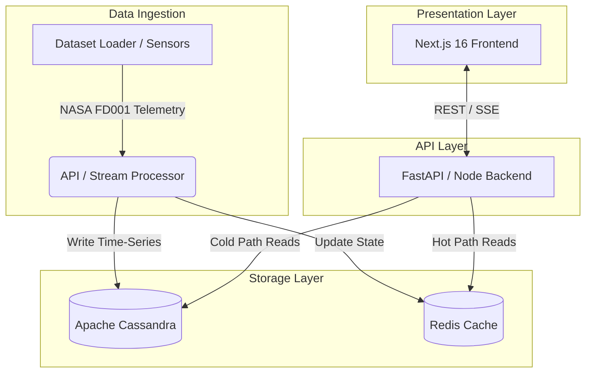

# VaneLoop ✈️
**Aircraft Engine Health Monitoring System**

VaneLoop is a production-grade, real-time aircraft turbofan engine health monitoring prototype. Originally conceptualized for a NoSQL Database architecture (Cassandra + Redis), this project demonstrates how to effectively ingest, store, and visualize high-velocity telemetry data to detect engine degradation and anomalies before they lead to critical failures.

---

## 🏗️ Architecture & Layering

The system is built on a decoupled, three-tier architecture designed to handle high-frequency sensor ticks (time-series data) while providing sub-millisecond reads for the dashboard view.

### 1. Data Layer (NoSQL Foundation)
*   **Apache Cassandra**: The source of truth for all historical time-series sensor data. Designed with two heavily optimized partition strategies to avoid `ALLOW FILTERING`:
    *   `engine_readings` (Partition Key: `engine_id`, Clustering Key: `cycle`): Optimized for pulling the full history of a single engine.
    *   `sensor_readings_by_sensor` (Partition Key: `sensor_id`, Clustering Key: `cycle`): Optimized for plotting fleet-wide trends of a single sensor type.
*   **Redis**: In-memory cache holding the *current* state (`engine:{id}:status`) of every engine to instantly paint the 100-tile Fleet Overview dashboard without touching disk.

### 2. API / Backend Layer
*   **FastAPI / Node**: A lightweight REST and Server-Sent Events (SSE) layer. It acts as a gatekeeper, routing heavy historical queries to Cassandra and fast status checks to Redis.

### 3. Presentation Layer (Frontend)
*   **Next.js 16 (App Router)** & **React 19**: Server-rendered and heavily optimized client application.
*   **Tailwind CSS v4 & shadcn/ui**: Built strictly with "Instrument-Panel Minimalism"—using raw structural grids, monospace data readouts, and aviation-accurate hex colors (`Glass Cockpit Dark` and `Skyline Day` modes).

---

## 👨‍✈️ User Point of View (POV)

### The Basics
As an aviation maintenance manager or fleet operator, your primary goal is simple: **know what's broken and what's about to break.** 
When you open VaneLoop, you are greeted by the **Fleet Overview**. This gives you a 30,000-foot view of your entire engine fleet (e.g., 100 engines). An engine tile glows Green (Nominal), Amber (Warning), or Red (Critical). If everything is green, you close the app. If something is amber, you investigate.

### The Deep Dive
When you click into a specific Amber engine (e.g., `FD001-023`), you transition from manager to engineer. 
1.  **The Readings Table**: You look at the raw telemetry data coming off the sensors (Temperature `T24`, `T50`, Pressure `P30`, Core Speed `Nf`) to see exactly what numbers breached the threshold.
2.  **Sensor Trend View**: You visually analyze the degradation curve. An engine doesn't just fail; it degrades over cycles. By tracking the curve on the Recharts graph, you can estimate the Remaining Useful Life (RUL) of the turbofan and schedule maintenance *before* it grounds a flight.
3.  **Alerts Feed**: If you manage hundreds of aircraft, you use the Alerts feed to filter chronologically by critical threshold breaches across the globe.

---

## 💻 Developer Point of View (POV)

### The Basics
Setting up the project requires bringing up the distributed database and the Next.js frontend.
1.  **Start the Data Layer**: Use Docker Compose to spin up Cassandra and Redis locally.
2.  **Seed the Data**: Run the Python ingestion script to parse the NASA C-MAPSS FD001 dataset and load it into Cassandra.
3.  **Start the Frontend**: Navigate to `/frontend` and run `npm install && npm run dev`. The dashboard expects the API to be running on localhost to feed the data tables.

### The Deep Dive: Why this Stack?
If you look closely at the `Benchmark` page in the application, the architectural decisions reveal themselves:
*   **Cassandra Partitioning over RDBMS**: A relational database `JOIN` or `WHERE` clause across millions of sensor ticks would bring the dashboard to a crawl. By duplicating data into two distinct Cassandra tables (`engine_readings` and `sensor_readings_by_sensor`), we trade cheap storage space for expensive compute time. Queries hit a specific partition and scan sequentially via the clustering key, returning results in ~12ms.
*   **The Cache Hot-Path**: The Fleet Overview dashboard has to load 100 engines instantly. Querying Cassandra 100 times per second for "latest status" is an anti-pattern. Instead, the ingestion pipeline writes the latest tick to Redis. The frontend fetches from Redis (8ms latency), meaning the dashboard scales infinitely without bottlenecking the Cassandra cluster.
*   **React Server Components (RSC) + Zustand**: The frontend uses Next.js RSCs to handle initial layout and structural rendering, pushing only interactive state (like the selected time-window filter or theme toggle) to the client via Zustand and TanStack Query. 
