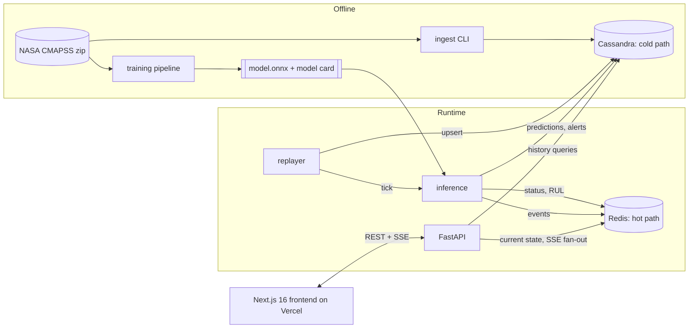

# VaneLoop — Technical Design Document

| | |
|---|---|
| **Version** | 1.0 (draft) |
| **Date** | 2026-10-01 |
| **Companion** | [PRD.md](./PRD.md) · [AGENTS.md](../AGENTS.md) · [SKILLS.md](../SKILLS.md) |

Status legend used below: ✅ exists today (per README / live site) · 🔨 to build.

---

## 1. Scope & current state

v0.1 is a Next.js frontend (per README: Next.js 16 App Router, React 19, Tailwind v4, shadcn/ui, Recharts, Zustand, TanStack Query) deployed on Vercel. Routes seen live: `/`, `/engine/[id]`, `/alerts`, `/benchmark`. The Cassandra, Redis, API and ingestion layers described in the README are not present in the deployed product. See PRD §2 for the audit.

This document defines the target system that makes the README true.

## 2. Architecture



**Design principles**

1. **Query-first modeling** for Cassandra: one table per query; no `ALLOW FILTERING`.
2. **Hot path never touches Cassandra:** Fleet view reads Redis only.
3. **Single source of truth:** every number on screen comes from the API; there are no hard-coded fixtures in components.
4. **Idempotent writes:** replays can restart at any time (upserts on the same primary key).
5. **Contract-first:** OpenAPI is the interface; TypeScript types are generated.
6. **Replaceable storage:** a `Store` interface with a Cassandra implementation and a lightweight SQLite/Parquet implementation for local demos and CI.

## 3. Data

### 3.1 Source
- Primary: NASA zip `CMAPSSData.zip` linked from the [NASA dataset page](https://data.nasa.gov/dataset/cmapss-jet-engine-simulated-data). The Kaggle mirror is a convenience copy; verify its checksums against the NASA zip before trusting it.
- Files per subset: `train_FDxxx.txt`, `test_FDxxx.txt`, `RUL_FDxxx.txt`. Space-separated, no header, trailing whitespace on rows.
- Columns: `unit, cycle, op1, op2, op3, s1…s21` (2 + 3 + 21 = 26). The NASA page's column list runs to "sensor measurement 26"; that is a typo — there are 21 sensors.

| Subset | Train engines | Test engines | Operating conditions | Fault modes |
|---|---|---|---|---|
| FD001 | 100 | 100 | 1 | 1 (HPC) |
| FD002 | 260 | 259 | 6 | 1 (HPC) |
| FD003 | 100 | 100 | 1 | 2 (HPC, Fan) |
| FD004 | 248 | 249 | 6 | 2 (HPC, Fan) |

Key semantics: train trajectories run to failure (RUL reaches 0). Test trajectories are truncated before failure; `RUL_FDxxx.txt` gives the true RUL at the last observed cycle of each test engine. Data is noisy and each engine starts with unknown, "normal" initial wear.

### 3.2 Sensor glossary

| Idx | Symbol | Meaning | Unit | FD001 informative? |
|---|---|---|---|---|
| 1 | T2 | Total temp, fan inlet | °R | no (constant) |
| 2 | **T24** | Total temp, LPC outlet | °R | yes |
| 3 | T30 | Total temp, HPC outlet | °R | yes |
| 4 | **T50** | Total temp, LPT outlet | °R | yes |
| 5 | P2 | Pressure, fan inlet | psia | no (constant) |
| 6 | P15 | Total pressure, bypass duct | psia | near-constant; often dropped |
| 7 | **P30** | Total pressure, HPC outlet | psia | yes |
| 8 | **Nf** | Physical **fan** speed | rpm | yes |
| 9 | Nc | Physical **core** speed | rpm | yes |
| 10 | epr | Engine pressure ratio | – | no (constant) |
| 11 | Ps30 | Static pressure, HPC outlet | psia | yes |
| 12 | phi | Fuel flow / Ps30 | pps/psi | yes |
| 13 | NRf | Corrected fan speed | rpm | yes |
| 14 | NRc | Corrected core speed | rpm | yes |
| 15 | BPR | Bypass ratio | – | yes |
| 16 | farB | Burner fuel-air ratio | – | no (constant) |
| 17 | htBleed | Bleed enthalpy | – | yes |
| 18 | Nf_dmd | Demanded fan speed | rpm | no (constant) |
| 19 | PCNfR_dmd | Demanded corrected fan speed | rpm | no (constant) |
| 20 | W31 | HPT coolant bleed | lbm/s | yes |
| 21 | W32 | LPT coolant bleed | lbm/s | yes |

The 14 informative FD001 sensors (`s2,3,4,7,8,9,11,12,13,14,15,17,20,21`) are the default feature set. Do not hard-code this list for FD002–FD004; compute variance per dataset and per operating condition and persist the selection in `config/features.yaml`. Fix the README: Nf is fan speed, Nc is core speed.

### 3.3 Preprocessing pipeline (`ml/preprocess.py`)
1. Parse; assign column names; cast types; assert unit/cycle monotonicity.
2. Compute train RUL: `rul = max_cycle(unit) − cycle`. Apply piecewise-linear cap: `rul_capped = min(rul, 125)`.
3. Drop constant/near-constant sensors (feature config).
4. **Operating-condition normalization** (FD002/FD004): cluster op settings into 6 regimes (k-means, k=6) and standardize each sensor *within regime*. For FD001/FD003 use global standardization.
5. Fit scaler on **train only**; persist with the model artifact.
6. Windowing: sliding windows of length 30; for the first 29 cycles left-pad by repeating the first row and set `warmup=true`.
7. Split by **engine** (GroupKFold / group shuffle split). Row-level splits leak and are forbidden; a unit test asserts zero unit overlap.
8. Test evaluation: last window per test engine vs. `RUL_FDxxx.txt` (do not cap the true labels when scoring).

### 3.4 Timestamps
C-MAPSS has no wall-clock time. The system defines a **replay clock**: `event_time = replay_start + (tick_index × tick_interval)`. Everything labelled "2m ago" is replay time and the UI must say so.

## 4. Storage design

### 4.1 Cassandra (cold path, source of truth)

Dev: single node, `SimpleStrategy`, RF=1. Production-like: `NetworkTopologyStrategy`, RF=3.

```cql
CREATE KEYSPACE IF NOT EXISTS vaneloop
  WITH replication = {'class': 'SimpleStrategy', 'replication_factor': 1};

-- Q1: full/recent history for one engine (newest first)
CREATE TABLE IF NOT EXISTS engine_readings (
  dataset text, unit int, cycle int,
  op1 double, op2 double, op3 double,
  s1 double, s2 double, s3 double, s4 double, s5 double, s6 double, s7 double,
  s8 double, s9 double, s10 double, s11 double, s12 double, s13 double,
  s14 double, s15 double, s16 double, s17 double, s18 double, s19 double,
  s20 double, s21 double,
  rul_true int,                          -- null unless labelled
  PRIMARY KEY ((dataset, unit), cycle)
) WITH CLUSTERING ORDER BY (cycle DESC);

-- Q2: one sensor across the fleet for a cycle range
-- Bucketing keeps partitions bounded as fleet size grows.
CREATE TABLE IF NOT EXISTS sensor_readings_by_sensor (
  dataset text, sensor text, cycle_bucket int,   -- bucket = floor(cycle / 50)
  cycle int, unit int, value double,
  PRIMARY KEY ((dataset, sensor, cycle_bucket), cycle, unit)
);

-- Q3: RUL predictions over an engine's life
CREATE TABLE IF NOT EXISTS engine_predictions (
  dataset text, unit int, cycle int, model_version text,
  rul_p10 float, rul_p50 float, rul_p90 float,
  health_index float, state text, warmup boolean,
  PRIMARY KEY ((dataset, unit), cycle, model_version)
) WITH CLUSTERING ORDER BY (cycle DESC, model_version ASC);

-- Q4: alert feed, newest first. Shard to avoid a hot day partition at scale.
CREATE TABLE IF NOT EXISTS alerts_by_day (
  dataset text, day date, shard int, ts timestamp, alert_id timeuuid,
  unit int, severity text, rule text, sensor text,
  reading double, threshold double, message text,
  PRIMARY KEY ((dataset, day, shard), ts, alert_id)
) WITH CLUSTERING ORDER BY (ts DESC, alert_id ASC)
  AND default_time_to_live = 7776000;           -- 90 days

-- Q5: alerts for one engine
CREATE TABLE IF NOT EXISTS alerts_by_engine (
  dataset text, unit int, ts timestamp, alert_id timeuuid,
  severity text, rule text, message text,
  PRIMARY KEY ((dataset, unit), ts, alert_id)
) WITH CLUSTERING ORDER BY (ts DESC, alert_id ASC)
  AND default_time_to_live = 7776000;
```

**Notes**
- The README's `sensor_readings_by_sensor (sensor_id → cycle)` design puts all engines for a sensor in one partition. That works at 100 engines but grows unbounded; the bucketed key above fixes it.
- Writes to `engine_readings` and `sensor_readings_by_sensor` are intentional denormalization. Do not use multi-partition logged batches for throughput; use async prepared statements with a concurrency cap (e.g. 128 in flight), or unlogged batches only within a single partition.
- Compaction: `TimeWindowCompactionStrategy` is a fit for `alerts_*` (TTL'd, append-only). Default STCS elsewhere is fine at this scale.
- Query → table map: history → Q1; fleet sensor trend → Q2; RUL chart → Q3; alerts feed → Q4; engine alerts → Q5. Any new endpoint needs a new query/table pair, not a filter.

### 4.2 Redis (hot path)

| Key | Type | Content | Written by |
|---|---|---|---|
| `vl:{ds}:engine:{unit}:status` | HASH | `cycle, state, rul_p10, rul_p50, rul_p90, hi, warmup, model_version, updated_at` | inference |
| `vl:{ds}:fleet:by_rul` | ZSET | member=`unit`, score=`rul_p50` | inference |
| `vl:{ds}:fleet:counts` | HASH | `nominal, warning, critical` (updated atomically on state change) | inference (Lua / `MULTI`) |
| `vl:{ds}:alerts` | STREAM | capped (`XADD … MAXLEN ~ 1000`) | alert engine |
| `vl:{ds}:ticks` | PUB/SUB channel | tick + status-change events for SSE fan-out | inference |

Rules: the cold path is authoritative. Redis can be rebuilt from Cassandra by `vaneloop rebuild-cache`. Do not give status keys a TTL shorter than the replay loop; stale detection uses `updated_at` instead.

## 5. ML design

### 5.1 Models

| Tier | Model | Purpose |
|---|---|---|
| T0 | LightGBM/XGBoost on rolling-window features (mean, std, slope over 5/10/30 cycles per sensor) | Fast baseline; sets the bar |
| T1 | 1D-CNN or GRU on 30×14 windows, capped-RUL target | Primary candidate |
| T2 | TCN / small Transformer | Stretch; only if it beats T1 on engine-level cross-validation |

Uncertainty (pick one, document in the model card): (a) quantile heads for p10/p50/p90 with pinball loss, calibrated by split-conformal on a held-out set of engines; or (b) deep ensemble of 5. Avoid reporting intervals that were not calibrated.

### 5.2 Metrics
- **RMSE** on last-cycle test predictions.
- **NASA score** (asymmetric; `d = pred − true`): `Σ (exp(−d/13) − 1)` if `d < 0`, else `Σ (exp(d/10) − 1)`. Late predictions are penalized harder.
- **Interval coverage** of the 80% band.
- **Alerting metrics** on train-set replay: lead time to first Critical; false Critical per lifetime.
Report mean ± std over ≥ 5 seeds. Follow the consistent-comparison guidance of Ramasso & Saxena (PRD §11).

### 5.3 Serving
- Export to **ONNX**; run with ONNX Runtime inside the replayer and API (CPU is enough: one 30×14 window per engine per tick).
- Artifact bundle: `model.onnx`, `scaler.json`, `features.yaml`, `model_card.md`, `metrics.json`, `version` (semver + git SHA + data checksum).
- `GET /api/v1/meta/model` returns the bundle metadata; the frontend `/model` page renders it.

### 5.4 Reproducibility
Pin seeds; log the dataset checksum; configs in `ml/configs/*.yaml` (Hydra or plain YAML); `uv.lock` committed; `make train` reproduces `metrics.json` within tolerance. Experiment layout can follow the Lightning + Hydra pattern in `ozogxyz/cmapss`.

### 5.5 Status & alert logic (`api/app/policy.py`)
- Status: see PRD §6. Implemented as a pure function `(rul_p10, rul_p50, prev_state, streak) → state`, unit-tested against edge cases and hysteresis.
- **R1 transition alerts:** emitted on state change upward (Nominal→Warning, Warning→Critical).
- **R2 sensor drift:** per engine, compute baseline mean/std over cycles 1–20; EWMA (λ≈0.2) of each informative sensor; alert when `|z| > 3` for 5 consecutive cycles. This respects per-engine initial wear and replaces fleet-wide absolute thresholds.
- **R3 RUL slope:** alert when predicted p50 falls faster than a configured cycles-per-cycle slope over a 10-cycle window (P1).
- Debounce: ≤ 1 alert per (engine, rule) per 5 cycles.
For FD002/FD004, R2 must operate on regime-normalized values.

## 6. Streaming & replay

`replayer` (Python service, same package as the API or separate container):

```
for tick in count():
    for engine in fleet:                       # staggered start offsets for variety
        row = source.next_row(engine)          # train: run to failure; test: truncated
        store.upsert_reading(row)              # Cassandra, async
        pred = model.predict(window(engine))   # ONNX
        policy.apply(engine, pred)             # state, alerts
        cache.update(engine, pred)             # Redis hash/zset/counts
        bus.publish(event)                     # Redis pub/sub
    sleep(TICK_MS)
```

- Modes: `train-replay` (full life, dramatic), `test-replay` (truncated; shows labelled RUL at end), `loop` (restart engine after failure with a fresh trajectory).
- Env: `REPLAY_TICK_MS` (default 1000), `REPLAY_SPEEDUP`, `REPLAY_MODE`, `REPLAY_SEED`.
- **SSE** endpoint `GET /api/v1/stream?dataset=FD001`: events `tick`, `status_change`, `alert`, `heartbeat` (every 10 s). Clients reconnect with `Last-Event-ID`; the server resumes from the Redis stream.
- Backpressure: drop `tick` events for slow consumers; never drop `alert` or `status_change`.

## 7. API (FastAPI, `/api/v1`)

OpenAPI is the contract (`api/openapi.json` committed; CI fails on drift). Pydantic v2 models; errors as RFC 9457 problem details.

| Method | Path | Source | Notes |
|---|---|---|---|
| GET | `/fleet?dataset=&state=&sort=` | Redis | Tiles + counts in one response; `ETag` supported |
| GET | `/engines/{dataset}/{unit}` | Redis + Cassandra | Current status + metadata |
| GET | `/engines/{dataset}/{unit}/readings?limit=&before_cycle=&sensors=` | Cassandra Q1 | Keyset pagination on `cycle` |
| GET | `/engines/{dataset}/{unit}/rul?from=&to=` | Cassandra Q3 | RUL trajectory with bands |
| GET | `/sensors/{dataset}/{sensor}/fleet-trend?from=&to=` | Cassandra Q2 | Server-side downsampling |
| GET | `/alerts?dataset=&severity=&rule=&unit=&before=` | Cassandra Q4/Q5 | Keyset pagination on `ts` |
| GET | `/stream?dataset=` | Redis | SSE |
| GET | `/benchmark/latest` | file/Cassandra | Latest committed run JSON |
| POST | `/benchmark/run` | — | Admin token; P2 |
| GET | `/meta/model`, `/meta/data` | files | Model card, data provenance |
| GET | `/healthz`, `/readyz` | — | Liveness / dependency readiness |

Conventions: engine IDs in URLs are `(dataset, unit)`; the display ID `FD001-023` is derived (`{dataset}-{unit:03d}`). Cache headers: `/fleet` `no-store` (SSE keeps it fresh); history endpoints `private, max-age=30`. Rate-limit public endpoints; require `Authorization: Bearer` for admin routes.

## 8. Frontend architecture

**Routes**

| Route | Rendering | Data |
|---|---|---|
| `/` | RSC shell; client grid | Initial `GET /fleet` on server, then SSE + TanStack Query |
| `/engine/[id]` | RSC for header/table; client charts | `readings`, `rul`, `status` |
| `/alerts` | RSC first page; client live prepend | `alerts` + SSE |
| `/benchmark` | RSC (static, revalidate) | `/benchmark/latest` |
| `/about`, `/model` 🔨 | RSC | `/meta/*` |

**State**
- Server state: TanStack Query. Query keys include `dataset`.
- Live updates: one `useFleetStream(dataset)` hook owns the `EventSource`, merges events into the query cache (`setQueryData`), exposes `connection: "live" | "reconnecting" | "stale"` used by the header badge.
- UI state only in Zustand: theme, selected sensors, time window, status filter.
- Validate API responses with Zod (or the generated client's runtime schemas); render the error state on schema mismatch rather than crashing.

**API client**: generate types with `openapi-typescript` from `api/openapi.json`; thin `fetch` wrapper in `frontend/lib/api/`. Delete hard-coded fixtures from components; tests use MSW with fixtures sampled from **real** FD001 rows.

**Charts**: Recharts is fine up to a few thousand points. Downsample on the server (LTTB) for fleet-trend; if profiling shows jank on engine detail, move the trend chart to uPlot. Always render a data table alternative for accessibility.

**Design tokens** (extend the existing "Glass Cockpit Dark" / "Skyline Day" themes): define status colors as CSS variables with a paired icon/shape (● nominal, ▲ warning, ■ critical). Monospace for numerics, tabular-nums enabled.

**Components (target)**: `FleetGrid`, `EngineTile`, `StatusBadge`, `ConnectionBadge`, `SensorTrendChart`, `RulChart`, `ReadingsTable`, `AlertsTable`, `BenchmarkChart`, `ModelCard`, `DisclaimerFooter`.

## 9. Benchmark methodology (`benchmarks/`)

| Scenario | Redis path | Direct-Cassandra path |
|---|---|---|
| S1 Fleet status (N = 100 / 1,000 / 10,000) | `GET /fleet` | Same data via a diagnostic endpoint that reads `engine_predictions` latest per engine (N partition reads) |
| S2 Engine history (200 rows) | – | `GET /readings` |
| S3 Sensor fleet trend | – | `GET /fleet-trend` |
| S4 Ingest throughput | – | upserts/s with and without cache update |

Method: load generator (k6 or Locust) with warm-up, ≥ 1,000 timed requests per scenario, fixed concurrency levels (1, 16, 64), cold-cache and warm-cache runs, report p50/p95/p99 and error rate. Record hardware, container limits, versions, dataset scale and git SHA in the result JSON. Synthetic scale-up data is generated by resampling real trajectories with noise and is labelled synthetic. **No hand-typed numbers** may appear on the benchmark page; it renders only committed result files.

## 10. Deployment

| Component | Local | Hosted (suggested) |
|---|---|---|
| Frontend | `npm run dev` | Vercel (existing) |
| API + replayer | `docker compose` | Small container host or VM (always-on process needed for SSE/replay; Vercel serverless functions are a poor fit for the replayer) |
| Cassandra | Docker | Managed Cassandra-compatible service (e.g. DataStax Astra DB) or self-hosted — verify current free-tier terms |
| Redis | Docker | Managed Redis (e.g. Upstash) — verify current limits |

Environment variables (never committed): `NEXT_PUBLIC_API_BASE_URL`, `CASSANDRA_CONTACT_POINTS`, `CASSANDRA_KEYSPACE`, `CASSANDRA_USERNAME`, `CASSANDRA_PASSWORD`, `REDIS_URL`, `ADMIN_TOKEN`, `REPLAY_*`, `MODEL_DIR`. Provide `.env.example`. CORS: allow only the Vercel origin(s).

`docker-compose.yml` services: `cassandra`, `redis`, `api`, `replayer`, optional `frontend`. Cassandra needs a health check (`cqlsh -e 'describe keyspaces'`) before `api` starts; run schema migration as a one-shot job.

## 11. Quality, observability, security

**Testing**
- Python: `pytest` (unit: policy, windowing, metrics; integration: Cassandra/Redis via Testcontainers or Compose), `ruff`, `mypy`/`pyright`.
- ML: leakage test (no unit overlap), deterministic-seed regression on `metrics.json`, window warm-up test.
- API: contract tests from OpenAPI (e.g. Schemathesis).
- Frontend: Vitest + Testing Library; Playwright e2e for Fleet → Engine → Alerts; axe-core accessibility checks.
- **Consistency test (P0):** fleet counts == number of tiles by state == statuses returned by engine endpoints, for a seeded replay snapshot.

**Observability:** structured JSON logs; OpenTelemetry traces API → Redis/Cassandra; metrics for tick latency, inference time, Redis hit ratio, SSE connections, alert rate.

**Security:** read-only public API; admin token for mutating routes; input validation on `dataset`/`sensor` against allow-lists; parameterized (prepared) CQL only; secrets from env; dependency audit in CI (`npm audit`, `pip-audit`); security headers on the frontend. Data is public and simulated, so no PII.

**CI (GitHub Actions):** lint + typecheck + unit tests on PR; OpenAPI drift check; frontend build; e2e on main; scheduled benchmark job producing an artifact.

## 12. Repository layout (target)

```
VaneLoop/
├── AGENTS.md  SKILLS.md  README.md
├── docs/            PRD.md  TECHNICAL.md  adr/
├── frontend/        Next.js app (exists)
├── api/             FastAPI app, policy, store adapters, openapi.json
├── replayer/        replay + inference loop (may live in api/)
├── ml/              preprocess, train, eval, configs, notebooks
├── infra/           docker-compose.yml, cassandra/schema.cql, redis/
├── benchmarks/      scenarios, results/*.json
├── data/            raw/ (gitignored; download script + checksums)
└── .agents/skills/  SKILL.md folders (see SKILLS.md)
```

## 13. Architecture decision records to write (`docs/adr/`)

1. ADR-001: Cassandra + Redis vs. simpler store; the thesis, the scale argument and the SQLite/Parquet fallback.
2. ADR-002: Python FastAPI vs. Node backend (recommend Python: same language as ML/ONNX tooling).
3. ADR-003: SSE vs. WebSocket (recommend SSE: one-way, proxies well, auto-reconnect).
4. ADR-004: Uncertainty method (quantile + conformal vs. ensemble).
5. ADR-005: Replay clock and timestamp semantics.
6. ADR-006: Status policy thresholds and hysteresis.

## 14. Known risks / open technical questions

- Cassandra write fan-out (two tables + predictions) per tick at 10k synthetic engines: measure before promising numbers.
- ONNX export parity with training framework: add a numerical-equivalence test (max abs diff < 1e-4).
- Per-engine baseline for R2 uses only 20 cycles; very short or noisy baselines may inflate false alarms: evaluate on train replay and tune.
- FD003/FD004 have two fault modes; a single RUL regressor may blur them. Consider a fault-mode auxiliary head later.
- The Kaggle mirror's file contents should be checksum-verified against the NASA zip before use.
